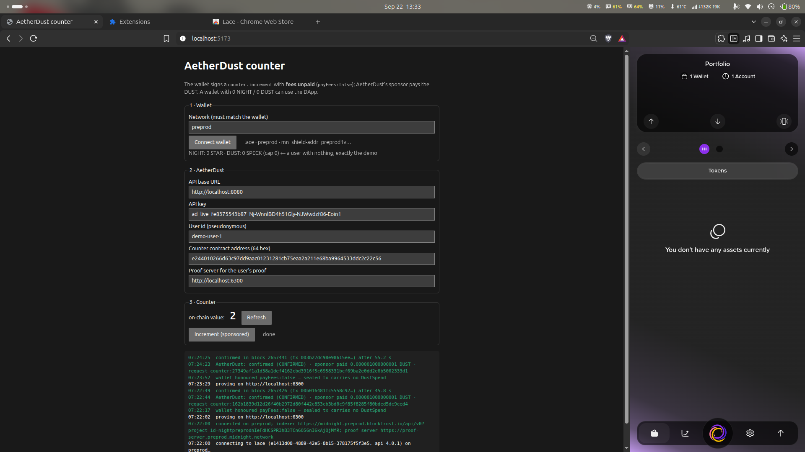

# AetherDust — and Private Allowlist Access

Two things live in this repository, and the second is what the first exists for.

**[Private Allowlist Access](examples/allowlist-dapp)** is a privacy dApp on Midnight: prove you are on an
allowlist without revealing which member you are. The list is public; your place on it is not. Written in Compact,
with a private witness, a Merkle membership proof and a domain-separated nullifier so each member is admitted
exactly once.

**AetherDust** is the infrastructure underneath it: a self-hostable DUST sponsorship control plane. The user signs,
the DApp asks, AetherDust enforces policy, budgets and limits, and a sponsor wallet pays the DUST. That is what
lets someone prove membership from a wallet holding **0 NIGHT and 0 DUST** — no tokens, no faucet, no onboarding.

```
member (Lace, payFees:false) ─signed tx─▶ DApp ─POST /v1/sponsorship/requests─▶ AetherDust api ──▶ Postgres ◀── worker (sponsor wallet) ──▶ Midnight
     proves membership in ZK                                                       auth · policy · budget           balance DUST · prove · merge · submit
```

## Privacy model (the dApp)

| | |
|---|---|
| **Public ledger state** | `members` — a `HistoricMerkleTree` of member commitments; `nullifiers` — one per admission; `admissions` — the tally; `owner` — a commitment to the operator's secret |
| **Private witnesses** | `localSecret()` — the caller's 32-byte secret; `memberPath()` — the Merkle path for its commitment. Neither leaves the member's machine |
| **`disclose()`** | exactly three, each commented in the source: the Merkle **path** (a position, not an identity), the **nullifier** (a domain-separated hash of the secret), and the public arguments — a member's commitment and the owner commitment |
| **An observer learns** | that *a* member of this list was admitted, when, and that the sponsor paid the fee |
| **An observer cannot learn** | your secret, which entry is yours, which admission was yours, or whether two admissions are related |

Full detail, including the witness-supplied-path attack the contract defends against:
[`examples/allowlist-dapp/README.md`](examples/allowlist-dapp/README.md).

## Status

- **The dApp**: contract compiles with `compact compile`; 7 tests against the circuit simulator; deployed on
  Midnight preprod (address below); browser DApp with Lace connect/disconnect and gasless admission.
- **AetherDust**: **v0.1.0**, all six phases complete — a Lace wallet with 0 NIGHT / 0 DUST had a contract call
  sponsored and confirmed on preprod for 0.000001000000001 DUST in block 2657441
  ([changelog](CHANGELOG.md), plan [§0.6](IMPLEMENTATION_PLAN.md)). The flow was first proven in
  [`spikes/sponsor-spike/SPIKE_REPORT.md`](spikes/sponsor-spike/SPIKE_REPORT.md).

**Docs:** [changelog](CHANGELOG.md) · [quickstart](docs/quickstart.md) · [integration guide](docs/integration.md) · [policy reference](docs/policy.md) ·
[runbooks](docs/runbooks.md) · [observability](docs/observability.md) · [threat model](docs/threat-model.md)

## Quickstart (Docker, mock sponsor)

```bash
cp deploy/.env.example deploy/.env            # set AETHERDUST_ADMIN_TOKEN
docker compose -f deploy/docker-compose.yml up --build -d
docker compose -f deploy/docker-compose.yml run --rm api cli bootstrap --name ExampleDApp --policy /app/scripts/demo-policy.json
#  → prints the API key once
AETHERDUST_API_KEY=ad_live_… scripts/demo.sh   # approve / reject / budget / idempotency / status / usage
open http://localhost:8090                      # operator dashboard (sign in with AETHERDUST_ADMIN_TOKEN)
open http://localhost:8080/docs                 # OpenAPI UI
```

Without Docker: `pnpm install && pnpm build`, point `AETHERDUST_DATABASE_URL` at any Postgres ≥ 14, then
`pnpm dev:api` and `pnpm dev:worker` (or `node apps/api/dist/main.js` / `node apps/worker/dist/main.js`).

## Real sponsor (Midnight)

The worker owns one sponsor wallet (seed → keys → `WalletFacade`); the api never loads wallet code and asks the worker
for fee estimates / health over a private, shared-secret RPC (`AETHERDUST_WORKER_URL`, `AETHERDUST_INTERNAL_SECRET`).

```bash
# 1. local `undeployed` chain (node + indexer + private proof server), genesis-funded sponsor
#    in deploy/.env: AETHERDUST_SPONSOR_ADAPTER=midnight, AETHERDUST_INTERNAL_SECRET=…, and the local-midnight block
docker compose -f deploy/docker-compose.yml --profile local-midnight up --build -d

# 2. preview / preprod: public RPC + indexer, your own proof server, your own seed
docker compose -f deploy/docker-compose.yml run --rm worker wallet new-seed        # → AETHERDUST_SPONSOR_SEED(_FILE)
docker compose -f deploy/docker-compose.yml run --rm worker wallet addresses       # fund the unshielded address (faucet)
docker compose -f deploy/docker-compose.yml run --rm worker wallet register-dust   # register NIGHT for DUST generation
docker compose -f deploy/docker-compose.yml run --rm worker wallet status          # balances, coins = max parallel sponsorships
docker compose -f deploy/docker-compose.yml --profile testnet up --build -d
#    (`worker wallet fund <mn_addr…> <night>` sends NIGHT from the configured wallet, e.g. to seed a second sponsor)
```

Throughput is bounded by the sponsor's DUST **coin count** (one in-flight sponsorship per coin; split NIGHT into more
UTXOs to raise it). The proof server sees the sponsor's witness data and must stay private. `SPONSOR_BALANCE_LOW`
(HTTP 503) is returned when the wallet would drop below `AETHERDUST_MIN_SPONSOR_DUST`. Fees are dynamic (block
fullness): the api reserves `estimate × (1 + margin)`, the worker settles the real `DustSpend.vFee`.

## Dashboard & observability

The dashboard (`apps/dashboard`, served by nginx on `:8090`, which proxies the api so it is same-origin) is the
operator's control plane: **Overview** (wallet, budgets per application, DUST over time, success rate, confirmation
p95, rejections, recent requests), **Requests** (filter by status/user; a drawer with the full audit trail),
**Usage** (PRD §19.4: DUST over time, by contract, by entry point, by user, rejections — with the table behind every
chart), **Policy** (JSON editor + `dry run`: replays the last N stored requests through a candidate policy and lists
exactly which ones would change outcome, without saving), **Applications** (create, suspend, API keys — the token is
shown once) and **Wallet**. It talks only to `/v1/admin/*` with the operator token, which it keeps in `sessionStorage`.

```bash
pnpm --filter @aetherdust/dashboard dev     # :5174, proxies /v1 to a local api on :8080
pnpm smoke:stack                            # the whole stack in one process with seeded traffic (:8099)
pnpm test:smoke                             # Playwright smoke over the built bundle
```

`GET /metrics` (api, and the worker on its private port) exposes Prometheus metrics (PRD §25): request rates and
outcomes by application and error code, rate-limit hits, HTTP latency, sponsor/submit durations and confirmation
latency (worker), plus gauges read from Postgres at scrape time — DUST sponsored, budget limit/settled/reserved/
remaining per application, requests by status, and the sponsor wallet (DUST, NIGHT, coins, synced, snapshot age).
`/metrics` requires a bearer token — the admin token, or a scoped `AETHERDUST_METRICS_TOKEN` — because the exposition
names applications, their budgets and the sponsor balance; `AETHERDUST_METRICS_PUBLIC=true` opens it for a private
network and `AETHERDUST_METRICS_ENABLED=false` removes it. A scrape config and the alerts worth having are in
[`deploy/prometheus.example.yml`](deploy/prometheus.example.yml). Every log line for a request carries `request_id`,
`application_id` and `transaction_id`.

## Client SDK (`@aetherdust/client`)

Browser and Node. Two layers: a REST client, and midnight-js providers for the DApp connector (Lace).

```ts
import { createAetherDustClient, createSponsoredMidnightProvider, findAetherDustError } from '@aetherdust/client';

const client = createAetherDustClient({ baseUrl: 'https://sponsor.example.com', apiKey: 'ad_live_…', userId: 'user-42' });

// midnight-js: the wallet balances+signs WITHOUT paying fees, AetherDust sponsors and submits
const lace = await window.midnight.lace.connect('preprod');
const sponsored = await createSponsoredMidnightProvider({ client, wallet: lace });
const providers = { ...otherProviders, walletProvider: sponsored, midnightProvider: sponsored };
await counter.callTx.increment();          // errors: findAetherDustError(e)?.code → 'USER_LIMIT_EXCEEDED' …

// or, with a sealed transaction in hand (PRD §32):
const r = await client.sponsor({ requestId: 'dapp:user-42:claim:7', transaction: sealedTx });  // → confirmed request
```

`sponsor()` long-polls then polls until the request is `confirmed` (or throws a typed `AetherDustError` with `code`,
`retryable`, `rejectedByPolicy`, `retryAfterSeconds`, and the persisted `request` for rejections). `until: 'approved'`
returns as soon as the request is queued; the user's own transaction identifier survives the merge and can be watched
right away. The DApp that uses all of this is [`examples/allowlist-dapp`](examples/allowlist-dapp).

## Integration in three calls

1. Build the transaction as usual with midnight-js; have the wallet balance it **without paying fees**
   (`connector.balanceUnsealedTransaction(tx, { payFees: false })`) and seal it.
2. `POST /v1/sponsorship/requests` with `Authorization: Bearer <api key>`:
   ```json
   { "request_id": "dapp:user:claim:42", "user_id": "user-42",
     "transaction": { "format": "midnight-ledger-v8", "encoding": "hex", "bytes": "<hex of tx.serialize()>" } }
   ```
   `202` = approved and queued (add `?wait=15000` to long-poll for the outcome); `4xx` = rejected with a machine-readable
   `error.code` (`CONTRACT_NOT_ALLOWED`, `ENTRY_POINT_NOT_ALLOWED`, `GLOBAL_BUDGET_EXCEEDED`, `USER_LIMIT_EXCEEDED`,
   `TRANSACTION_LIMIT_EXCEEDED`, `RATE_LIMITED`, `DUPLICATE_REQUEST`, `PREFLIGHT_FAILED`, …).
3. `GET /v1/sponsorship/requests/{request_id}` until `status` is `confirmed` or `failed`. The response carries
   `transaction_id` (the identifier to watch on the indexer) and `sponsored_dust`. The user's own transaction identifier
   survives the merge, so the DApp may also watch `user_transaction_identifiers[0]` right away.

`GET /v1/usage` returns remaining budget, per-user usage and breakdowns. Full schema at `/openapi.json`.

## Policy

Set with `PUT /v1/admin/applications/{id}/policy` (or `aetherdust set-policy`). Every rule fails closed and is evaluated
against the **actual transaction bytes**, never the DApp's claims (claims, if sent, must match).

```json
{
  "enabled": true,
  "contracts": { "<64-hex contract address>": ["increment", "claim"] },
  "allow_multiple_calls": false,
  "limits": { "period": "daily", "global_budget_dust": "100", "per_user_budget_dust": "1", "max_fee_per_tx_dust": "0.1" },
  "rate_limit": { "requests_per_minute_per_credential": 60, "requests_per_minute_per_user": 10, "requests_per_minute_per_ip": 120 },
  "preflight": { "min_ttl_remaining_seconds": 300, "max_tx_bytes": 524288 }
}
```
Budgets are calendar-aligned UTC periods. A request **reserves** `estimate × (1 + AETHERDUST_FEE_MARGIN)` atomically
against both the global and the per-user bucket, **settles** the actual on-chain fee on confirmation, and **releases**
the reservation on any failure. Policy changes create a new version and apply to the next request.

## Request lifecycle

`RECEIVED → RESERVED → SPONSORING → SUBMITTED → CONFIRMED`, with `REJECTED` (before any reservation),
`SPONSORING_FAILED` / `SUBMISSION_FAILED` / `EXPIRED` (reservation released) and `TIMEOUT` (reservation kept until the
reconciler resolves it). Every transition is an audit event (`GET /v1/admin/requests/{id}`). The merged transaction
bytes are persisted **before** submission, so a worker crash can never lose track of a possibly-submitted transaction;
on restart the worker drains those first, then resumes.

## Layout

| Path | What |
|---|---|
| `packages/core` | pure domain: policy engine, budget math, state machine, error codes, API keys, rate limiter |
| `packages/db` | Postgres schema (`migrations/`), repositories, atomic reservation, `SKIP LOCKED` claims |
| `packages/midnight` | `SponsorAdapter` contract, real ledger-v8 inspector + `wellFormed` pre-flight, mock adapter, **real adapter** (`WalletFacade`, DUST-only balancing, post-merge check, node error mapping), api-side remote adapter (+ Phase 0 fixtures) |
| `packages/config` | validated environment |
| `apps/api` | Fastify API (`/v1/sponsorship/*`, `/v1/usage`, `/v1/admin/*`, `/docs`), operator CLI |
| `apps/worker` | single-writer sponsorship worker: recovery, reconciler, private `/internal` RPC + `/metrics`, `wallet` CLI |
| `apps/dashboard` | operator dashboard (React + Vite): overview, requests, usage, policy editor + dry run, API keys, wallet |
| `deploy/` | Dockerfile, compose, `.env.example` |
| `packages/client` | `@aetherdust/client`: REST client + connector-backed midnight-js providers, typed errors |
| `examples/allowlist-dapp` | **Private Allowlist Access**: the Compact contract + its tests, and the browser DApp (Lace `payFees:false` + AetherDust) |
| `test/e2e` | real-chain e2e: user wallet (0 NIGHT/0 DUST) + counter contract → api → worker → confirmed; the SDK over a connector-shaped wallet |
| `test/smoke` | one-process stack with seeded traffic + the Playwright dashboard smoke test |
| `spikes/sponsor-spike` | Phase 0: the live proof of DUST sponsorship on Midnight (+ `deploy/native/stack.sh` to run the chain without Docker) |

## Development

```bash
pnpm install
pnpm -r typecheck && pnpm build
pnpm test            # unit + integration (starts an embedded Postgres unless AETHERDUST_TEST_DATABASE_URL is set)
pnpm test:smoke      # dashboard smoke test (Playwright; needs `npx playwright install chromium` once)

# e2e on a real local chain (~4 min incl. the wallet sync; nightly in CI). Either bring the chain up alone…
docker compose -f deploy/docker-compose.yml -f deploy/docker-compose.e2e.yml --profile local-midnight up -d --wait midnight-node indexer proof-server
pnpm test:e2e        # api + worker run inside the test; also proves fund → register-dust on a fresh seed
                     # (or: spikes/sponsor-spike/deploy/native/stack.sh up — no Docker)
# …or the whole deployment, and drive the containers (adds a SIGKILL of the worker mid-sponsorship):
AETHERDUST_ENV_FILE=e2e.env docker compose -f deploy/docker-compose.yml -f deploy/docker-compose.e2e.yml --profile local-midnight up -d --build --wait
AETHERDUST_ADMIN_TOKEN=e2e-compose-admin-token-0123456789 AETHERDUST_E2E_WORKER_CONTAINER=aetherdust-worker-1 pnpm test:e2e:deployed
```

## Security notes

- The `api` process never holds the sponsor seed; only `worker` does, and it listens on no public port (its
  `/internal` RPC is shared-secret protected and only answers estimate/health — it cannot spend).
- The sponsor only ever balances `['dust']`; before submission the merged transaction is checked to be the user's
  transaction plus exactly one `DustSpend` with no negative imbalance, so a user can never make the sponsor move NIGHT.
- API keys are stored as scrypt hashes; the token is shown exactly once. Admin routes use a separate operator token;
  the dashboard holds it in `sessionStorage` only and never talks to Midnight itself.
- Rate limiting and body-size limits run before any transaction is deserialised; the same transaction bytes can never be
  sponsored twice (`tx_hash` is unique across every non-rejected request), independent of `request_id`.
