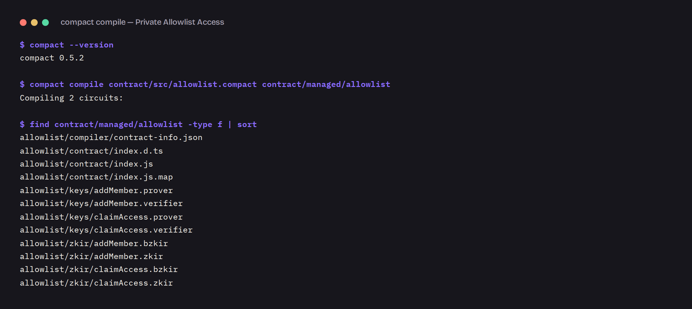
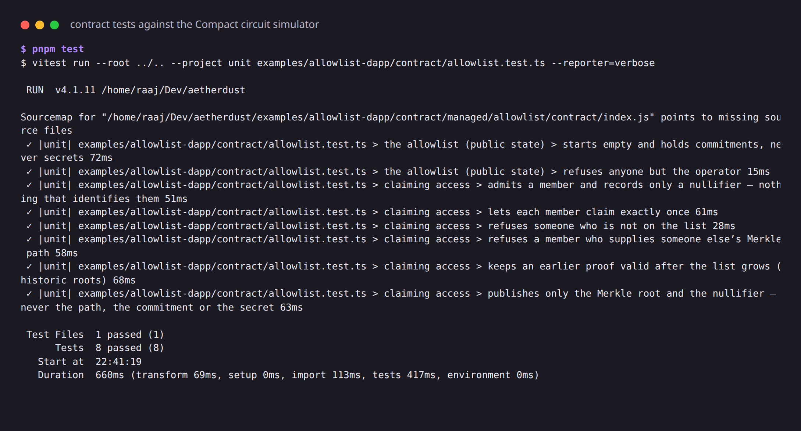

# Private Allowlist Access

Prove you are on an allowlist without revealing which member you are — and get through the door from a wallet
holding no tokens at all, because [AetherDust](../../README.md) pays the transaction fee.

The list is public. Your place on it is not.

```
operator                          the chain                       a member
────────                          ─────────                       ────────
addMember(commitment) ─────────▶  members: HistoricMerkleTree
                                  nullifiers: Set
                                  admissions: Counter
                                                     ◀──────────  claimAccess()
                                                                  proves: I hold a secret whose
                                                                  commitment is a leaf of `members`
                                  +1 nullifier                    reveals: nothing else
                                  +1 admission
```

## The privacy model

| | |
|---|---|
| **Public ledger state** | `members` (a Merkle tree of commitments, with every root it has ever had), `nullifiers` (one per admission), `admissions` (the tally), `owner` (a commitment to the operator's secret) |
| **Private witnesses** | `localSecret()` — the caller's 32-byte secret, and `memberPath()` — the Merkle path authenticating its commitment. Neither is ever transmitted; the circuit consumes them and proves a statement about them |
| **Deliberately disclosed** | the Merkle **root** the proof was made against (which version of the list — never the path, which would point at your leaf), the **nullifier** (a domain-separated hash of the secret), and the public arguments: a member's commitment when the operator adds it, and the owner commitment at deployment |

**What an observer learns:** that a member of this allowlist was admitted, at a particular time, and that the
sponsor paid the fee; the nullifier; and which version of the list (Merkle root) the proof was made against. The
commitments and the tally are public by design.

**What an observer cannot learn:** your secret; which entry on the list is yours; which admission was yours;
whether two admissions came from people who know each other. The nullifier is stable per member — that is what
makes "one admission each" enforceable — but it is not linkable back to a commitment or a secret.

**The one thing that narrows it:** the disclosed root. Because the tree is historic, a proof against an *older* root
hides you among the members who were on the list at that point, not the whole list today. The DApp always proves
against the current tree, so in practice your anonymity set is every member at the moment you claim.

The compiler is what enforces this. Compact treats every witness-derived value, and every circuit parameter, as
private until you write `disclose()`. The contract has five such calls — the owner commitment, an added member's
commitment, the Merkle root, and the nullifier (checked, then inserted) — each commented with what it gives away.
A test reads the public transcript of a real `claimAccess` and checks it holds exactly the root and the nullifier:
not the path, not the commitment, not the secret.

### The pitfall this contract avoids

A Merkle path is supplied by the witness, which means the caller controls it. Verifying only "this path leads to
the root" lets any member claim with any *other* member's path — spending someone else's entitlement. `claimAccess`
therefore binds the path to the caller first:

```compact
assert(path.leaf == persistentHash<Bytes<32>>(secret), "path is not for this member");
assert(members.checkRoot(disclose(merkleTreePathRoot<10, Bytes<32>>(path))), "not on the allowlist");
```

`allowlist.test.ts` includes that attack as a test.

## Tested, not asserted

| | |
|---|---|
| `contract/allowlist.test.ts` | 8 tests against the Compact circuit simulator: operator-only membership, admission, one claim per member, non-members refused, the borrowed-path attack refused, historic roots, and the public transcript of a claim holding only the root and the nullifier |
| `test/e2e/allowlist.e2e.test.ts` | 3 tests on a real `undeployed` chain with AetherDust in the loop: **a member holding 0 NIGHT / 0 DUST is admitted with the sponsor paying**, a second admission is refused by the spent nullifier, and a stranger is refused by the circuit before AetherDust is ever asked |

```bash
pnpm test                                   # the circuit tests (works from here or the repo root)
# from the repo root, with a local chain up (see the root README → Development):
AETHERDUST_E2E=1 pnpm vitest run --project e2e test/e2e/allowlist.e2e.test.ts
```

## The contract

[`contract/src/allowlist.compact`](contract/src/allowlist.compact) — two circuits:

- **`addMember(commitment)`** — operator only. Authorisation is a proof, not a signature: the caller must know the
  secret behind the `owner` commitment fixed at deployment.
- **`claimAccess()`** — prove membership and be admitted, once.

```bash
pnpm compile      # compact compile → contract/managed/allowlist (circuits, prover/verifier keys), copied to public/ for the browser
pnpm test         # 8 tests against the circuit simulator
```





*(Both images render the verbatim output of those two commands.)* CI re-runs the compile on a clean machine and
checks the committed circuits and keys are byte-for-byte what this source produces.

## Running it

Prerequisites: Node 22, Docker, the [Compact toolchain](https://docs.midnight.network/getting-started/installation),
a running AetherDust (see the [quickstart](../../docs/quickstart.md)), and the Lace wallet extension.

```bash
# 1. deploy the contract and admit three demo members, in one wallet session
cd examples/allowlist-dapp
set -a && . ../../deploy/.env && set +a
docker compose -f ../../deploy/docker-compose.yml -f ../../deploy/docker-compose.e2e.yml --profile testnet up -d proof-server
pnpm deploy-contract setup 3
#  → { contractAddress, members: [{ secret, commitment }, …] }

# 2. let AetherDust sponsor this contract's claimAccess entry point
#    (dashboard → Policy, or PUT /v1/admin/applications/<id>/policy)

# 3. run the DApp
pnpm dev        # http://localhost:5173
```

In the browser: open **Connection settings**, paste the contract address and your AetherDust API key, then paste one
of the demo secrets into **Import a secret**. Connect Lace on the same network and press **Prove membership and
enter**. Use a secret that is *not* on the list to see the refusal, and press the button twice to see the nullifier
refuse a second admission.

A member wallet needs **no NIGHT and no DUST**. The proving happens in the browser, the wallet seals the
transaction with `payFees: false`, and AetherDust's sponsor wallet pays.

## Notes

- The member secret is kept in this browser's local storage so a demo survives a reload. A real deployment would
  keep it in the wallet or a password manager.
- Public proof servers generally do not send CORS headers a browser page can use, so the DApp points at the
  operator's proof server by default (published by `docker-compose.e2e.yml`).
- Tree depth is 10, so this allowlist holds up to 1024 members. Raising it is a one-word change and a recompile.
